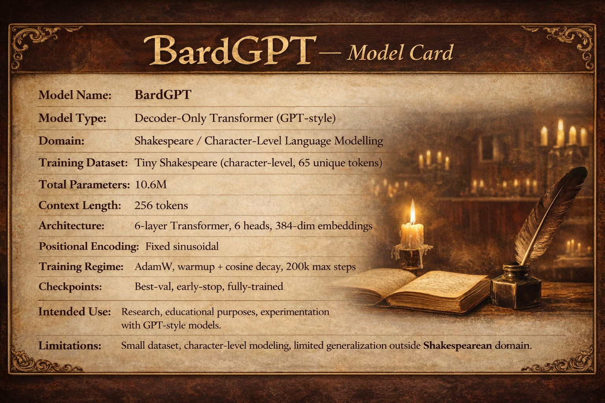
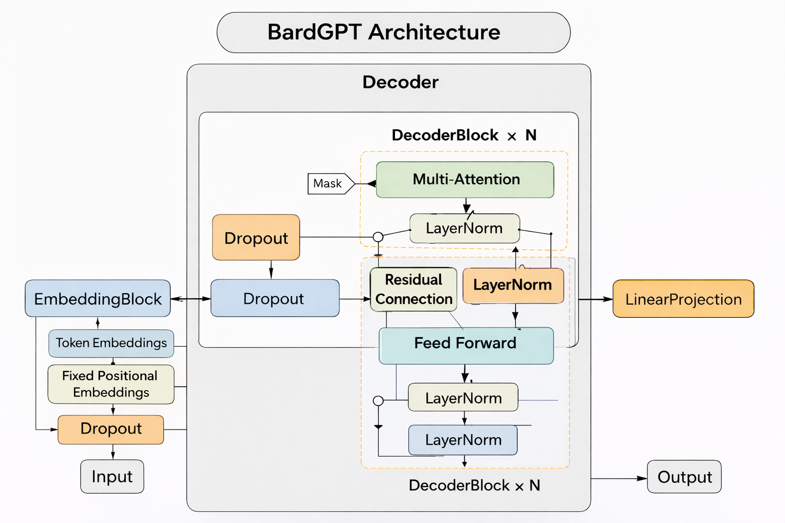
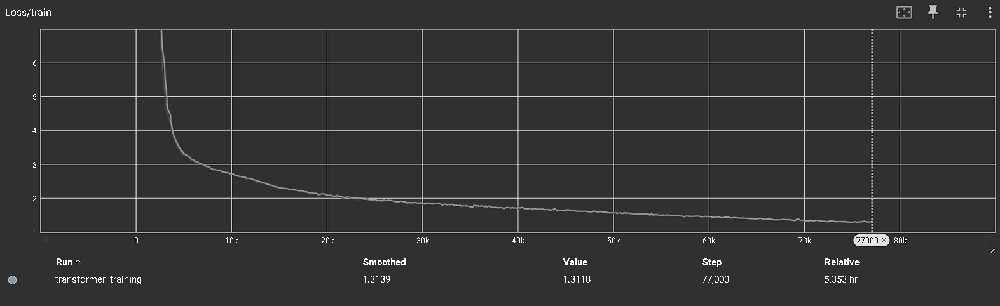
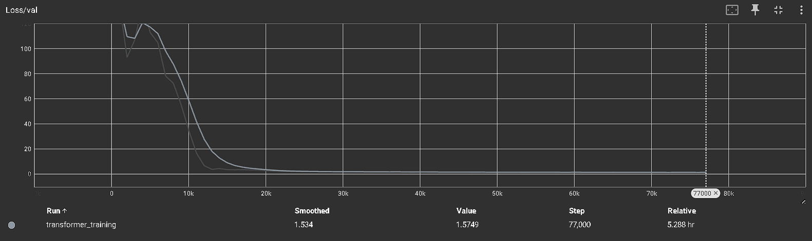

# **BardGPT**

> A decoder-only Shakespeare-style language model trained from scratch with modern Transformer techniques.

[]()
[]()
[]()
[]()
[]()
[]()

<p align="center">
  
</p>

## Architecture Diagram

<p align="center">
  
</p>

## Overview

BardGPT is a compact, fully transparent, decoder-only Transformer trained from scratch on the *Tiny Shakespeare* corpus.
This repository provides a clean, extensible implementation suitable for research, pedagogical study, and controlled experimentation with GPT-style language models.

The project emphasizes:

* Minimal but rigorous engineering
* Reproducible training pipelines
* Readable Transformer internals
* Faithful causal decoding
* High-quality documentation and logs

---

# **1. Features**

* Decoder-only Transformer (GPT-style)
* Fixed sinusoidal positional embeddings
* Causal self-attention
* AdamW optimization with warmup + cosine decay
* Gradient clipping and early stopping
* Fully transparent training loop
* Lightweight character-level tokenizer (65 unique tokens)
* Extensive checkpoint management (best, intermediate, early-stop)
* TensorBoard logging
* Training from scratch and sampling utilities

---

# **2. Architecture Summary**

### **TransformerConfig**

```
vocab_size = 65
d_model = 384
d_ff = 1536
n_layers = 6
n_heads = 6
dropout = 0.2
seq_length = 128
max_seq_length = 256
steps = 200000
use_fixed_positional_embeddings = True
```

### **Model Characteristics**

* **Total Parameters:** 10,664,832
* **Type:** Decoder-only, causal masked Transformer
* **Embedding:** Learned token embeddings + optional sinusoidal positional embeddings
* **Attention:** Multi-Head Self Attention (masked)
* **Feedforward:** 4 × d_model expansion, GELU
* **Regularization:** Dropout throughout
* **Training Regime:**

  * 200k max steps
  * Warmup: 2000 steps
  * Cosine decay to 10% LR
  * Batch size: 64

---

# **3. Repository Structure**

```
transformer/
├── attention.py
├── block.py
├── embedding.py
├── model.py
├── utils.py
├── sample.py
├── train.py
├── runs/
│   └── transformer_training/...
├── checkpoints/ (ignored by git)
└── data loader and training scripts
```

---

# **4. Installation**

### **Dependencies**

```
numpy>=1.23
torch>=2.0
sentencepiece>=0.1.99
jupyter>=1.0
ipykernel>=6.0
matplotlib>=3.7
tensorflow
tensorboard
```

Install all requirements:

```
pip install -r requirements.txt
```

---

# **5. Dataset**

BardGPT uses a character-level version of the **Tiny Shakespeare** corpus.

The DataLoader performs:

* Vocabulary extraction
* Character→index and index→character mappings
* Sliding-window batching for both train/val splits

```
90% training split  
10% validation split
```

---

# **6. Training**
Run training from scratch:
To maintain consistent path resolution semantics, invoke the training script from the project root:

```
python transformer/train.py
```

The training loop implements:

* Masked self-attention
* AdamW
* Warmup + cosine LR decay
* Gradient clipping
* Best-validation checkpointing
* Early stopping (patience = 5)
* TensorBoard logging

Checkpoints automatically save to:

```
checkpoints/best_val_*.pt
checkpoints/step_*.pt
checkpoints/early_stop_*.pt
checkpoints/final_*.pt
```

---

# **7. Sampling**

To sample from a trained checkpoint:
Sampling must be invoked from the root-level working directory to ensure correct relative path resolution:
```
python transformer/sample.py
```

The script:

* Loads the configured model
* Restores the checkpoint
* Performs causal sampling with temperature-based generation
* Emits text in Shakespearean style

---

# **8. Model Output (Sample)**

Below is an example generated from the **best_val_0072000.pt** checkpoint.

```
ROMEO:
Good morrow, tribunes, and thank you may leave it.

FRIAR LAURENCE:
I cannot leave your grace, and I do cry thee,
Which was a very word of his prince,
And shall hear the hand not richer: these over-souls
Which shall be rubful should not deserved thou statest,
Before he is out of subjects; he was of woe,
Let him cannot have spoken to me.

LEONTES:
Well, sir, sir, what may not will clied by the
dust of all and my head him.

PAULINA:
The more business to my cousin, should speak her head;
he would we must not for the side will not.

DUKE VINCENTIO:
The children, look to her severe, here is no less of regal,
that turn'd the truth of the were is a love,
As shall be that sun shall for the angel, and grave
But they to give thee the one of his people,
That thou makest her be roas, and with the royal sun
And shall have clouds with the people of thy soul.
```

---

# **9. Results & Evaluation**

### **Validation Loss Curve**



### **Training Loss Curve**




---

# **10. Checkpoints**

Included in the releases:

* **Best validation-loss checkpoint**
* **Early-stopped checkpoint**

Checkpoints directory is intentionally excluded from version control.

### Pretrained Weights

The following official BardGPT checkpoints are available for download:

- **best_val_loss.pt**  
  Best-performing checkpoint based on validation perplexity  
  [best_val_0072000.pt](https://drive.google.com/drive/folders/11BwP0AUHjOpPgG9wVS7KdZoV0WmLyPtI?usp=sharing)

- **final_model.pt**  
  Fully-trained model saved after early stopping  
  [early_stop_0077000.pt](https://drive.google.com/drive/folders/11BwP0AUHjOpPgG9wVS7KdZoV0WmLyPtI?usp=sharing)

You can also find these files in the GitHub Release section:
https://github.com/Himanshu7921/BardGPT/releases/

---

# **11. License**

BardGPT is released under the **MIT License**.

---

# **12. Acknowledgements**

This project acknowledges the following foundational works and frameworks:

* *Attention Is All You Need*
* PyTorch Development Team
* TensorBoard and its maintainers
* OpenAI’s early GPT research
* Shakespeare character-level modeling tradition
* Himanshu Singh (Author)

---

# **13. Contributions**

Contributions, discussions, and research extensions are welcome.
Please follow standard open-source practices for submitting PRs, issues, or enhancements.

---

# **14. Future Work**

Planned upgrades:

* Rotary embeddings
* FlashAttention integration
* Training-time activation statistics
* Dynamic sequence lengths
* Extended datasets
* LoRA-based fine-tuning
